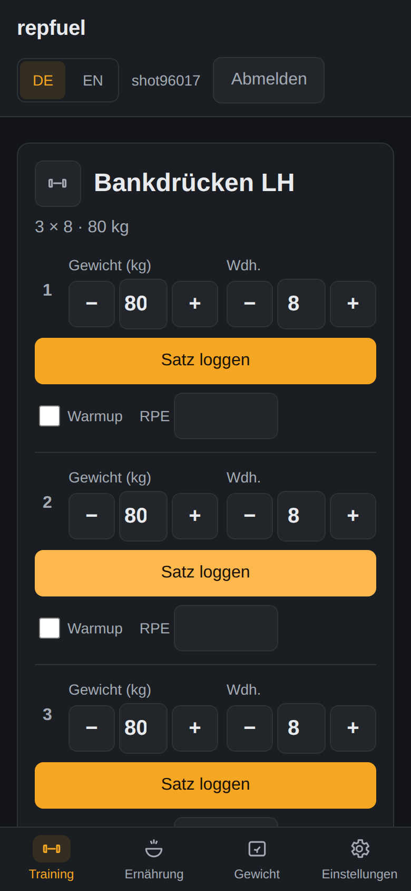
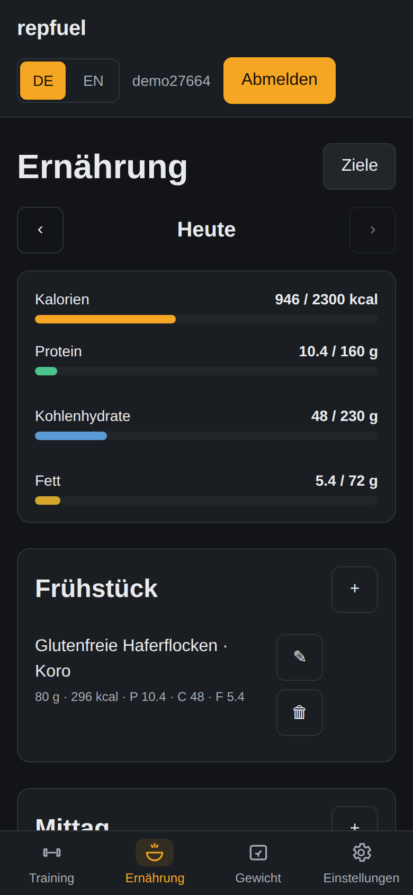
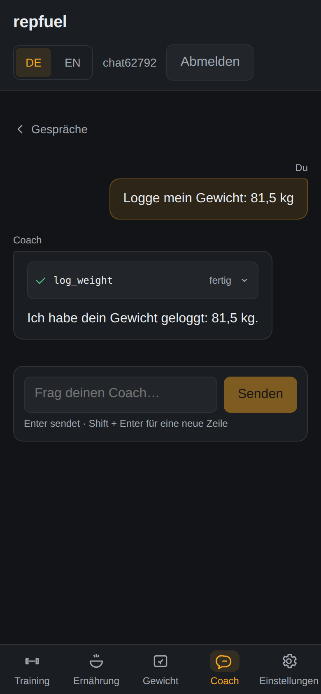
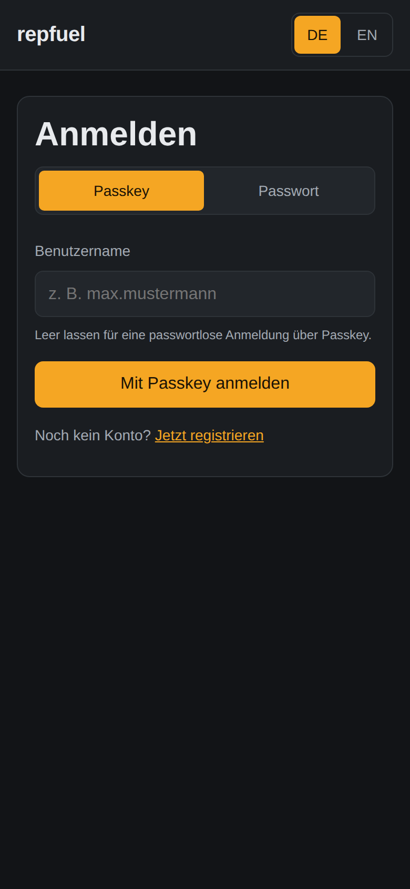
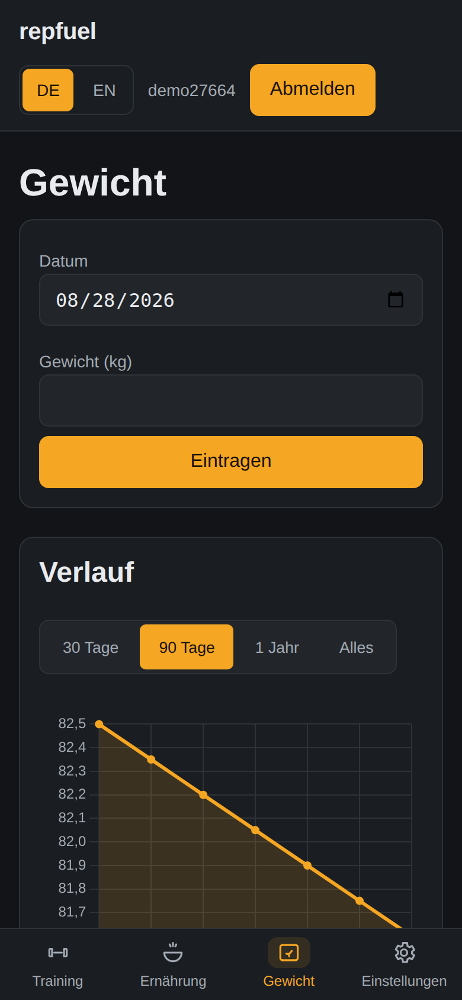

<div align="center">

# repfuel

**Self-hosted Fitness- & Ernährungs-Tracking mit optionalem KI-Coach.**
Deine Daten, dein Server.

[](LICENSE)
[](docker-compose.yml)
[](#quickstart)
[](#ki-coach-konfigurieren-optional)

</div>

repfuel kombiniert Workout-Tracking (Routinen, Sätze, Rest-Timer, PRs,
Cardio-Aktivitäten) und Ernährungs-Tagebuch (Open Food Facts, Barcode-Scan,
kcal-/Makro-Ziele) in einer installierbaren PWA — offline-first fürs Logging,
Multi-User mit strikt getrennten Daten, und einem KI-Coach mit persönlichem
Gedächtnis, der per Tool-Calling auf deine eigenen Daten zugreift (API, Ollama
oder dein Claude-Abo via CLI — strikt optional).

| | | |
|---|---|---|
|  |  |  |
|  |  | |

## Features

- **Workouts:** Routinen mit Supersets & Zielvorgaben, 1324 Übungen mit
  Schritt-Anleitungen und Animationen, Logging-Screen für die Bedienung
  zwischen zwei Sätzen (Stepper, letzte Gewichte vorausgefüllt, Rest-Timer),
  PRs, Übungs-Verlauf (Top-Satz/1RM/Volumen) und freie Aktivitäten
  (Laufen, Radfahren, …).
- **Ernährung:** Tagebuch mit Übersichts-Ring und Mahlzeit-Budgets,
  Lebensmittelsuche (Open Food Facts + lokaler Cache), Barcode-Scan
  (Kamera, manuelle Eingabe als Fallback), „Zuletzt geloggt“-Vorschläge,
  Quick-kcal, Zielberechnung (Mifflin-St Jeor), Wasser- & Fasten-Tracking.
- **Gewicht & Health:** Gewichtsverlauf mit Chart, Apple-Health-Import über
  die App „Health Auto Export“ (Schritte, Ruhepuls, aktive kcal, Schlaf, Gewicht).
- **Offline-first PWA:** Sätze, Mahlzeiten und Gewicht landen zuerst in
  IndexedDB und syncen automatisch; installierbar auf Android & iOS.
- **KI-Coach (opt-in):** Chat mit Streaming, echten Daten-Tools und einem
  persönlichen Gedächtnis pro Nutzer (Vorhaben, Vorlieben, Unverträglichkeiten
  — sichtbar und löschbar im Profil). Schreibaktionen an Routinen/Zielen
  immer nur als Vorschlag mit Bestätigung im UI.
- **Multi-User:** Passkeys (empfohlen) + Passwort-Login, Invite-Links,
  Admin-Panel, erster Nutzer wird automatisch Admin.
- **Deine Daten:** kompletter JSON-Export mit einem Klick. AGPL-3.0.

## Quickstart

Voraussetzungen: Docker + Docker Compose.

```bash
git clone https://github.com/Cripacx/repfuel.git
cd repfuel
cp .env.example .env
docker compose up -d
```

Dann http://localhost:8080 öffnen und den ersten Nutzer registrieren
(wird automatisch Admin). Migrationen und der Übungs-Seed laufen beim
Start automatisch.

> **Wichtig:** Für den Betrieb unter eigener Domain `ORIGIN` in der `.env`
> exakt auf die öffentliche URL setzen — Passkeys (WebAuthn) und die
> PWA-Installation brauchen HTTPS (außer auf `localhost`).
> Reverse-Proxy-Beispiel: [docs/SELF_HOSTING.md](docs/SELF_HOSTING.md).

## KI-Coach konfigurieren (optional)

Ohne Konfiguration ist die KI komplett deaktiviert (`AI_PROVIDER=none`) und
die App voll funktionsfähig — kein Chat-Tab, keine externen Aufrufe.

Der Coach beantwortet Fragen zu deinen echten Daten (Tool-Calling auf
Mahlzeiten, Workouts, Gewicht, Ziele), **merkt sich dauerhaft**, was du ihm
erzählst („ich laufe im Mai einen Halbmarathon“, „ich mag keinen Brokkoli“,
„laktoseintolerant“) und berücksichtigt das bei Trainingsplänen und
Rezeptvorschlägen. Das Gedächtnis ist pro Nutzer getrennt und im
**Profil-Tab** einsehbar, ergänzbar und löschbar. Änderungen an Routinen
oder Zielen schlägt der Coach nur vor — angewendet wird erst nach deiner
Bestätigung im UI.

Alle Einstellungen liegen in der `.env` (kommentiert in
[.env.example](.env.example)); nach Änderungen `docker compose up -d`.

### Variante 1 — API-Provider (Anthropic, OpenAI, OpenRouter)

```dotenv
AI_PROVIDER=anthropic        # oder: openai | openrouter
AI_API_KEY=sk-ant-…
AI_MODEL=claude-opus-5       # Modell-ID deines Providers, siehe Tabelle
AI_MODEL_LIGHT=              # optional: günstigeres Modell für Hilfsaufgaben
```

| Provider | `AI_MODEL`-Beispiel | Key erstellen |
|---|---|---|
| `anthropic` | `claude-opus-5`, `claude-sonnet-5` | [console.anthropic.com](https://console.anthropic.com/) |
| `openai` | `gpt-5.2` | [platform.openai.com](https://platform.openai.com/) |
| `openrouter` | `anthropic/claude-opus-5` | [openrouter.ai](https://openrouter.ai/) |

### Variante 2 — Lokal mit Ollama (keine Cloud, kein API-Key)

```dotenv
AI_PROVIDER=ollama
AI_BASE_URL=http://ollama:11434/v1
AI_MODEL=qwen3
```

```bash
docker compose --profile ollama up -d
docker compose exec ollama ollama pull qwen3
```

Das Modell **muss Tool-Calling beherrschen** (z. B. `qwen3`, `llama3.1`) —
der Status im Profil-Tab prüft das und meldet ungeeignete Modelle.

### Variante 3 — Claude-Abo über die Claude-Code-CLI (kein API-Key)

Nutzt dein bestehendes Claude-Abo statt einer API-Abrechnung:

```dotenv
AI_PROVIDER=cli
CLAUDE_CODE_OAUTH_TOKEN=…    # auf einem Rechner mit Claude-Login: `claude setup-token`
```

```bash
docker compose --profile cli-adapter up -d
```

Details zum CLI-Adapter und den Auth-Wegen: [docs/AI_CLI.md](docs/AI_CLI.md).

### Prüfen, ob alles läuft

Im **Profil-Tab** zeigt der Abschnitt „KI“ Provider, Modell und
Verbindungsstatus; der Coach-Tab erscheint automatisch, sobald ein Adapter
aktiv ist. Ohne aktiven Adapter zeigt `/chat` eine Anleitung mit genau
diesen Variablen.

| Variable | Bedeutung | Default |
|---|---|---|
| `AI_PROVIDER` | `none` · `anthropic` · `openai` · `openrouter` · `ollama` · `cli` | `none` |
| `AI_API_KEY` | API-Key des Providers (nicht für `ollama`/`cli`) | – |
| `AI_MODEL` | Modell-ID des Providers | – |
| `AI_MODEL_LIGHT` | optionales günstiges Modell für Hilfsaufgaben | `AI_MODEL` |
| `AI_BASE_URL` | Basis-URL für Ollama/OpenAI-kompatible Endpunkte | – |
| `CLAUDE_CODE_OAUTH_TOKEN` | Auth-Token für den CLI-Adapter (`claude setup-token`) | – |

## Apple-Health-Import

In den Einstellungen ein API-Token erzeugen und in der iOS-App
[Health Auto Export](https://www.healthyapps.dev/) einen REST-Export
einrichten: URL `https://<host>/api/v1/ingest/health`, Header
`Authorization: Bearer <token>`, Format JSON. Schritte, Ruhepuls, aktive
kcal und Schlaf erscheinen im Dashboard; Gewicht fließt zusätzlich in den
Gewichtsverlauf. Details: [docs/HEALTH_IMPORT.md](docs/HEALTH_IMPORT.md).

## Entwicklung

Voraussetzungen: Node ≥ 22, pnpm ≥ 10, Postgres + Redis (lokal oder per Docker).

```bash
pnpm install
pnpm --filter @repfuel/shared build
pnpm db:migrate          # DATABASE_URL zeigt auf deine Postgres
pnpm dev                 # Server :8080 + Vite-Dev-Server mit /api-Proxy
pnpm test                # Vitest (shared + server + web)
pnpm typecheck && pnpm lint
```

Monorepo-Struktur: `apps/server` (Fastify, Modular Monolith),
`apps/web` (SvelteKit-SPA/PWA), `apps/ai-cli-sidecar` (Claude-Code-Sidecar),
`packages/shared` (zod-Contracts, Zielberechnung). Architektur-Leitplanken
stehen in [CLAUDE.md](CLAUDE.md) und [IMPLEMENTIERUNGSPROMPT.md](IMPLEMENTIERUNGSPROMPT.md).

## Danksagungen & Datenquellen

- Übungsbibliothek: [exercises-dataset](https://github.com/hasaneyldrm/exercises-dataset)
  (Daten MIT, © Hasan Emir Yıldırım). Die Übungsmedien gehören
  [Gym visual](https://gymvisual.com/), liegen nicht im Repo/Image und werden
  einmalig vom Self-Hoster geladen — Details in
  [seed/README.md](apps/server/src/modules/workout/seed/README.md).
- Altbestand einzelner Übungen: [wger](https://github.com/wger-project/wger)-Exercise-DB,
  [CC-BY-SA 4.0](https://creativecommons.org/licenses/by-sa/4.0/).
- Lebensmitteldaten: [Open Food Facts](https://openfoodfacts.org),
  [Open Database License](https://opendatacommons.org/licenses/odbl/1-0/).
- Inspiration: [openGym](https://github.com/alexpcosta/opengym), YAZIO, Hevy, wger.

## Lizenz

[AGPL-3.0](LICENSE)
